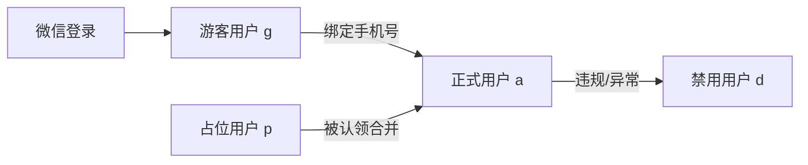
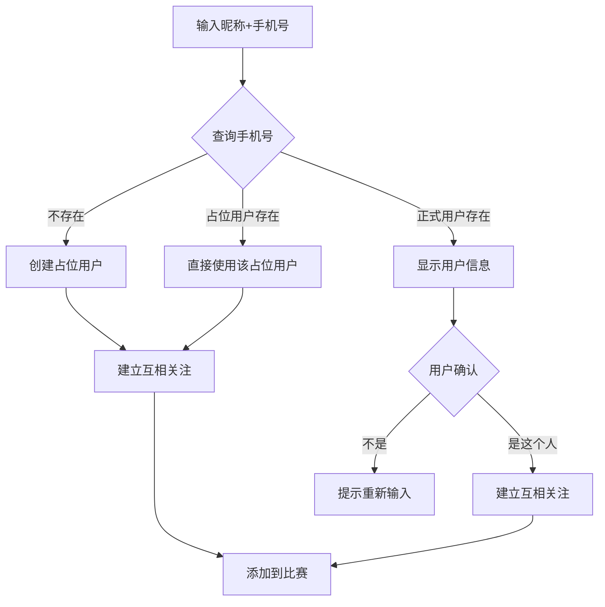

# 用户/好友/关注体系设计

## 一、用户类型体系

### 用户类型流转



### 用户类型说明

| 类型 | status | 创建方式 | 权限 |
|------|--------|----------|------|
| 游客用户 | `g` | 微信登录，未绑定手机号 | 只能围观比赛 |
| 正式用户 | `a` | 绑定手机号后 | 完整功能（创建比赛、建球队等） |
| 占位用户 | `p` | 他人替报名创建（昵称+手机号） | 无法登录，待认领 |
| 已合并用户 | `m` | 占位用户被认领后 | 数据已迁移，仅保留记录 |
| 禁用用户 | `d` | 管理员操作 | 无法登录，无法被搜索 |

### 保留游客用户的原因

- **降低门槛**：用户可以先微信登录"逛逛"，围观比赛结果
- **渐进转化**：等用户想参赛/创建比赛时，再引导绑定手机号
- **灵活围观**：对于只想看朋友比赛结果的用户，不强制绑定

### 用户类型判断逻辑

```plain
判断用户类型（直接通过 status 字段）：
- status='g' → 游客用户 (guest)
- status='a' → 正式用户 (active)
- status='p' → 占位用户 (placeholder)
- status='m' → 已合并用户 (merged)
- status='d' → 禁用用户 (disabled)
```

### 禁用场景

+ 用户违规（发布不当内容、恶意行为等）
+ 账号异常（疑似被盗、批量注册等）
+ 用户主动申请注销

### 用户表设计 `user`

```sql
CREATE TABLE `user` (
  `id` INT PRIMARY KEY AUTO_INCREMENT,
  `openid` VARCHAR(64) DEFAULT NULL COMMENT '微信openid',
  `unionid` VARCHAR(64) DEFAULT NULL COMMENT '微信unionid',
  `phone` VARCHAR(20) DEFAULT NULL COMMENT '手机号',
  `wx_nickname` VARCHAR(100) DEFAULT NULL COMMENT '微信昵称（微信授权时自动获取）',
  `nickname` VARCHAR(50) NOT NULL COMMENT '显示昵称（用户可修改）',
  `avatar` VARCHAR(255) DEFAULT NULL COMMENT '头像',
  `status` CHAR(1) DEFAULT 'g' COMMENT 'g:游客 a:正式用户 p:占位用户 m:已合并 d:禁用',
  `created_by` INT DEFAULT NULL COMMENT '占位用户的创建者ID',
  `is_vip` CHAR(1) DEFAULT 'n' COMMENT 'y:VIP用户(解锁更多隐私设置)',
  `created_at` DATETIME DEFAULT CURRENT_TIMESTAMP,
  `updated_at` DATETIME DEFAULT CURRENT_TIMESTAMP ON UPDATE CURRENT_TIMESTAMP,
  UNIQUE KEY `uk_openid` (`openid`),
  UNIQUE KEY `uk_phone` (`phone`)
) COMMENT='用户表';
```

**关于 UNIQUE 约束与 NULL**：

+ `openid` 和 `phone` 字段设置为 UNIQUE，但允许 NULL
+ MySQL 中多个 NULL 值不违反 UNIQUE 约束，这是预期行为
+ 占位用户(p)没有 openid；已合并用户(m)的 phone 会被置空

---

## 二、昵称字段设计

保留两个字段，职责分明：

| 字段 | 来源 | 用途 | 更新时机 |
|------|------|------|----------|
| `wx_nickname` | 微信授权 | 存储微信原始昵称 | 每次微信登录时自动更新 |
| `nickname` | 用户输入/系统设置 | 显示名称 | 用户可随时修改 |

**显示优先级**：`nickname` > `wx_nickname`

**各场景下的昵称处理**：

| 场景 | wx_nickname | nickname |
|------|-------------|----------|
| 微信登录（首次） | 从微信获取 | 同 wx_nickname |
| 微信登录（后续） | 自动更新 | 保持不变（除非用户主动修改） |
| 替朋友报名创建占位用户 | 空 | 创建者输入的昵称 |
| 占位用户被合并 | 从微信获取 | **用 wx_nickname 覆盖** |

---

## 三、替朋友报名流程

### 流程图



### 场景处理规则

| 场景 | 处理方式 |
|------|----------|
| 手机号不存在 | 创建占位用户(status=p)，建立互相关注 |
| 手机号属于正式用户(a) | 展示头像+昵称，让用户确认是否就是这个人 |
| 手机号属于占位用户(p) | 直接使用已存在的占位用户，建立互相关注 |
| 手机号属于游客用户(g) | 同正式用户，展示确认 |

### 替朋友报名 = 建立互相关注

```sql
-- A 替 B 报名后，自动插入双向关注（互关=好友关系）
INSERT INTO user_follow (user_id, target_id) VALUES (A, B);
INSERT INTO user_follow (user_id, target_id) VALUES (B, A);
```

注意：对于占位用户(p)，B->A 的关注记录也会创建，合并后保留。

---

## 四、占位用户合并逻辑

当用户A绑定手机号X时：

1. 查找是否存在 phone=X 且 status='p' 的占位用户B
2. 如果存在，执行数据迁移：
    - 比赛记录、成绩数据 → 迁移到A
    - B被他人关注的关系 → target_id 改为A（**保留 is_special 特别关注状态**）
    - B关注他人的关系 → target_id 改为A（保留占位用户建立的互关）
    - 他人对B的备注名 → target_id 改为A
3. **昵称处理**：`nickname = wx_nickname`（用微信昵称覆盖占位时的昵称）
4. 将B的 status 改为 'm'（已合并），phone 置空（释放手机号）
5. A绑定手机号X，完成合并

---

## 五、关注/好友体系

### 关系说明

```plain
A 关注 B  →  A是B的粉丝，B是A的关注对象
B 也关注 A  →  互相关注 = 好友关系
```

### 关注的前置条件

| 关注者 | 被关注者 | 是否允许 | 说明 |
|--------|----------|----------|------|
| 正式用户(a) | 正式用户(a) | ✓ | 正常关注 |
| 正式用户(a) | 游客用户(g) | ✓ | 可以关注游客 |
| 正式用户(a) | 占位用户(p) | ✓ | 可以关注，合并后自动迁移到正式用户 |
| 正式用户(a) | 禁用用户(d) | ✗ | 禁用用户不可被关注 |
| 正式用户(a) | 已合并用户(m) | ✗ | 已合并用户不可被关注 |
| 游客用户(g) | 任何用户 | ✗ | 游客不能主动关注他人 |
| 占位用户(p) | 任何用户 | 特殊 | 仅通过"替朋友报名"自动建立互关 |

### 禁用用户的特殊处理

+ 用户被禁用后，**已有的粉丝关系保留**，但粉丝无法查看其内容
+ 禁用用户**无法被搜索**，无法被新用户关注
+ 如需完全清理，管理员可手动删除关注关系

### 关注表设计 `user_follow`

```sql
CREATE TABLE `user_follow` (
  `id` INT PRIMARY KEY AUTO_INCREMENT,
  `user_id` INT NOT NULL COMMENT '关注者',
  `target_id` INT NOT NULL COMMENT '被关注者',
  `is_special` CHAR(1) DEFAULT 'n' COMMENT 'y:特别关注 n:普通关注',
  `created_at` DATETIME DEFAULT CURRENT_TIMESTAMP,
  UNIQUE KEY `uk_follow` (`user_id`, `target_id`),
  KEY `idx_user_id` (`user_id`),
  KEY `idx_target` (`target_id`)
) COMMENT='关注关系表';
```

### 特别关注

用户可以将已关注的人标记为"特别关注"，用于：

+ 列表中优先展示
+ 快速筛选查找

### 查询好友（互关）

```sql
-- 查询用户A的好友列表（互相关注）
SELECT u.* FROM user u
WHERE u.id IN (
  SELECT f1.target_id FROM user_follow f1
  INNER JOIN user_follow f2
    ON f1.user_id = f2.target_id AND f1.target_id = f2.user_id
  WHERE f1.user_id = :userId
);
```

---

## 六、备注名

用户可以给**已关注的人**设置备注名（类似微信备注功能）。

| 类型 | 说明 | 可见范围 |
|------|------|----------|
| **昵称** | 用户自己的名字（微信昵称或自己修改） | 所有人可见 |
| **备注名** | A给B设置的名字 | 只有A自己可见 |

**显示优先级**：备注名 > nickname > wx_nickname

**占位用户合并**：合并后昵称被微信昵称覆盖，但他人设置的备注名保留

**取消关注时**：保留备注名记录，重新关注后自动恢复显示

### 备注名表设计 `user_remark`

```sql
CREATE TABLE `user_remark` (
  `id` INT PRIMARY KEY AUTO_INCREMENT,
  `user_id` INT NOT NULL COMMENT '设置者',
  `target_id` INT NOT NULL COMMENT '被备注者',
  `remark_name` VARCHAR(50) NOT NULL COMMENT '备注名',
  `updated_at` DATETIME DEFAULT CURRENT_TIMESTAMP ON UPDATE CURRENT_TIMESTAMP,
  UNIQUE KEY `uk_remark` (`user_id`, `target_id`),
  KEY `idx_target` (`target_id`)
) COMMENT='用户备注名表';
```

### 显示名称逻辑

```plain
获取用户B的显示名称（对A而言）：
1. 查询 user_remark 中 A 对 B 的备注名
2. 如果有备注名 → 返回备注名
3. 如果没有 → 返回 B 的 nickname
4. 如果 nickname 为空 → 返回 B 的 wx_nickname
```

---

## 七、拉黑体系

### 黑名单表 `user_block`

```sql
CREATE TABLE `user_block` (
  `id` INT PRIMARY KEY AUTO_INCREMENT,
  `user_id` INT NOT NULL COMMENT '操作者',
  `blocked_id` INT NOT NULL COMMENT '被拉黑者',
  `created_at` DATETIME DEFAULT CURRENT_TIMESTAMP,
  UNIQUE KEY `uk_block` (`user_id`, `blocked_id`),
  KEY `idx_blocked` (`blocked_id`)
) COMMENT='黑名单表';
```

### 拉黑效果

当 A 拉黑 B 时：

+ B **无法**查看 A 的：比赛、历史成绩、动态
+ B **无法**关注 A
+ **双向解除关注**：A 对 B 的关注、B 对 A 的关注都会自动删除
+ A 对 B 的备注名保留（方便识别），B 对 A 的备注名删除

### 取消拉黑

+ 取消拉黑后，双方需要**重新关注**才能恢复好友关系
+ 之前的关注关系不会自动恢复

---

## 八、隐私设置

### 隐私设置表 `user_privacy`

```sql
CREATE TABLE `user_privacy` (
  `user_id` INT PRIMARY KEY,
  `phone_searchable` CHAR(1) DEFAULT 'y' COMMENT 'y:可被搜索 n:禁止',
  `profile_visible` CHAR(1) DEFAULT 'y' COMMENT 'y:主页对陌生人可见 n:隐藏 [VIP]',
  `game_history_visible` CHAR(1) DEFAULT 'y' COMMENT 'y:比赛记录对陌生人可见 n:隐藏 [VIP]',
  `allow_stranger_follow` CHAR(1) DEFAULT 'y' COMMENT 'y:允许陌生人关注 n:禁止 [VIP]',
  `updated_at` DATETIME DEFAULT CURRENT_TIMESTAMP ON UPDATE CURRENT_TIMESTAMP
) COMMENT='隐私设置表';
```

### VIP 与隐私设置的关系

| 设置项 | 普通用户 | VIP用户 |
|--------|----------|---------|
| `phone_searchable` 手机号搜索 | ✓ 可设置 | ✓ 可设置 |
| `profile_visible` 主页可见性 | ✗ 默认公开 | ✓ 可设置 |
| `game_history_visible` 比赛记录可见性 | ✗ 默认公开 | ✓ 可设置 |
| `allow_stranger_follow` 陌生人关注 | ✗ 默认允许 | ✓ 可设置 |

**说明**：

+ 所有用户都有 `user_privacy` 记录，首次登录时自动创建（使用默认值）
+ 非VIP用户的 VIP 专属设置会被忽略，按默认值处理
+ 用户升级VIP后，之前设置的值立即生效

---

## 九、添加关注的场景

| 场景 | 入口 | 说明 |
|------|------|------|
| 搜索手机号 | 通讯录/搜索页 | 需对方开启手机号搜索 |
| 扫码 | 扫一扫 | 扫描用户二维码 |
| 比赛中 | 比赛详情页 | 点击参赛者头像 → 关注 |
| 广场围观 | 广场/比赛列表 | 点击任意用户 → 关注 |
| 好友推荐 | 推荐列表 | 基于共同球友等推荐 |
| **替朋友报名** | 报名页 | 自动建立互相关注 |

---

## 十、边缘情况处理

| 情况 | 处理 |
|------|------|
| A 已经关注 B，再替 B 报名 | 跳过已存在的关注记录，不重复插入 |
| A 替 B 报名，B 已拉黑 A | 不建立关注关系，仅添加到比赛（或提示无法操作） |
| A 替 B 报名，手机号输错（属于 C） | 确认界面展示 C 的信息，A 发现不对可重新输入 |
| 占位用户合并时已有互关 | 保留关注关系，不重复创建 |

---

## 附录：字段命名对照

设计文档与实际数据库 `t_user` 表的字段对照：

| 设计文档 | 实际表 t_user | 说明 |
|----------|---------------|------|
| `phone` | `mobile` | 手机号 |
| `nickname` | `nickname` | 用户昵称（显示名） |
| `wx_nickname` | `wx_nickname` | 微信原始昵称 |
| `created_by` | `helper_id` | 占位用户的创建者ID |
| - | `reg_type` | 注册类型：weixin/remark/remarkwithmobile |

---

## 附录：关系图总览

```plain
┌─────────────────────────────────────────────┐
│                  用户类型                    │
├─────────────────────────────────────────────┤
│  游客用户 ──绑定手机号──▶ 正式用户               │
│                              ▲              │
│  占位用户 ─────合并─────────┘                 │
└─────────────────────────────────────────────┘

┌─────────────────────────────────────────────┐
│                  社交关系                    │
├─────────────────────────────────────────────┤
│   A ──关注──▶ B     A是B的粉丝                │
│   A ──特别关注──▶ B  优先展示、快速筛选         │
│   B ──关注──▶ A     互关=好友                 │
│   B ──拉黑──▶ A     B无法看A的任何内容          │
│                                             │
│   A ──替B报名──▶    自动建立互相关注           │
└─────────────────────────────────────────────┘
```
