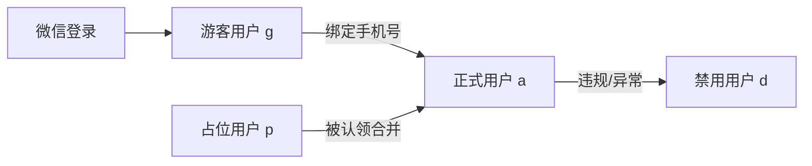
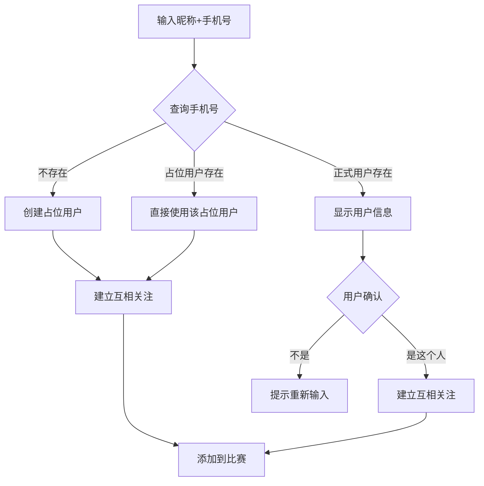

# 用户体系设计优化方案

## 一、用户类型体系

### 用户类型流转



### 各类型说明

| 类型 | status | 创建方式 | 权限 |
|------|--------|----------|------|
| 游客用户 | `g` | 微信登录，未绑定手机号 | 只能围观比赛 |
| 正式用户 | `a` | 绑定手机号后 | 完整功能 |
| 占位用户 | `p` | 他人替报名创建（昵称+手机号） | 无法登录，待认领 |
| 已合并用户 | `m` | 占位用户被认领后 | 数据已迁移，仅保留记录 |
| 禁用用户 | `d` | 管理员操作 | 无法登录，无法被搜索 |

### 保留游客用户的原因

- **降低门槛**：用户可以先微信登录"逛逛"，围观比赛结果
- **渐进转化**：等用户想参赛/创建比赛时，再引导绑定手机号
- **灵活围观**：对于只想看朋友比赛结果的用户，不强制绑定

---

## 二、昵称字段设计

保留两个字段，职责分明：

| 字段 | 来源 | 用途 | 更新时机 |
|------|------|------|----------|
| `wx_nickname` | 微信授权 | 存储微信原始昵称 | 每次微信登录时自动更新 |
| `nickname` | 用户输入/系统设置 | 显示名称 | 用户可随时修改 |

**显示优先级**：`nickname` > `wx_nickname`

**占位用户合并后**：用微信昵称覆盖 `nickname`

---

## 三、替朋友报名流程



### 场景处理规则

| 场景 | 处理方式 |
|------|----------|
| 手机号不存在 | 创建占位用户(status=p)，建立互相关注 |
| 手机号属于正式用户(a) | 展示头像+昵称，让用户确认是否就是这个人 |
| 手机号属于占位用户(p) | 直接使用已存在的占位用户，建立互相关注 |
| 手机号属于游客用户(g) | 同正式用户，展示确认 |

---

## 四、好友关系

**替朋友报名 = 建立互相关注**

```sql
-- A 替 B 报名后，自动插入双向关注
INSERT INTO user_follow (user_id, target_id) VALUES (A, B);
INSERT INTO user_follow (user_id, target_id) VALUES (B, A);
```

注意：对于占位用户(p)，B->A 的关注记录也会创建，合并后保留。

---

## 五、占位用户合并逻辑更新

当用户B绑定手机号X时，若存在占位用户：

1. 迁移比赛记录、成绩数据到B
2. 迁移关注关系（包括占位用户的双向关注）
3. 迁移他人对占位用户的备注名
4. **昵称处理**：`nickname = wx_nickname`（用微信昵称覆盖）
5. 占位用户 status 改为 'm'，phone 置空

---

## 六、需要更新的文件

1. **[Docs/10_用户体系.md](Docs/10_用户体系.md)** - 更新设计文档

   - 明确 `wx_nickname` 与 `nickname` 的区别
   - 添加"替朋友报名"场景的完整流程
   - 更新合并逻辑中的昵称处理规则
   - 补充自动建立互相关注的说明

2. **数据库 Schema** - 确认字段定义（当前已有 `wx_nickname` 和 `nickname`，无需修改）

---

## 七、边缘情况补充

| 情况 | 处理 |
|------|------|
| A 已经关注 B，再替 B 报名 | 跳过已存在的关注记录，不重复插入 |
| A 替 B 报名，B 已拉黑 A | 不建立关注关系，仅添加到比赛（或提示无法操作） |
| A 替 B 报名，手机号输错（属于 C） | 确认界面展示 C 的信息，A 发现不对可重新输入 |
| 占位用户合并时已有互关 | 保留关注关系，不重复创建 |

---

## 八、字段命名对照

设计文档与实际数据库的字段对照：

| 设计文档 | 实际表 t_user | 说明 |
|----------|---------------|------|
| `phone` | `mobile` | 手机号 |
| `nickname` | `nickname` | 用户昵称（显示名） |
| `wx_nickname` | `wx_nickname` | 微信原始昵称 |
| `created_by` | `helper_id` | 占位用户的创建者ID |
| - | `reg_type` | 注册类型：weixin/remark/remarkwithmobile |

---

## 九、讨论结论汇总

| 问题 | 结论 |
|------|------|
| wx_nickname vs nickname 怎么用？ | 保留两个字段，wx_nickname 存微信原始昵称，nickname 作为显示名 |
| 占位用户合并后昵称怎么处理？ | 用微信昵称覆盖 nickname |
| 手机号属于正式用户怎么处理？ | 展示用户信息（头像+昵称），让操作者确认是否就是这个人 |
| 手机号属于占位用户怎么处理？ | 直接使用已存在的占位用户 |
| 替朋友报名是否建立关注？ | 建立互相关注（双向关注 = 好友关系） |
| 是否保留游客用户类型？ | 保留，允许用户先围观再绑定手机号 |