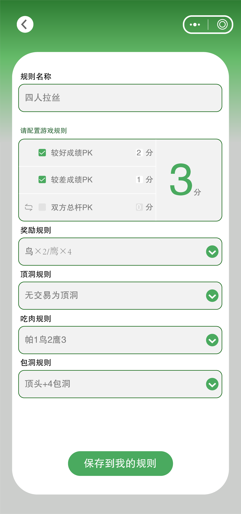
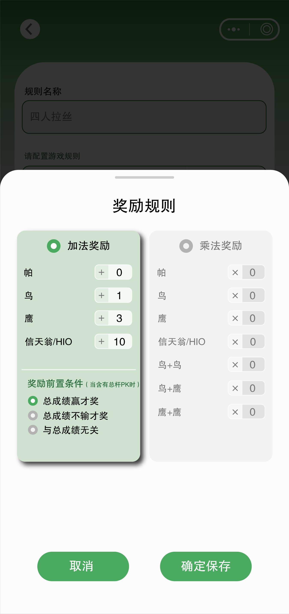
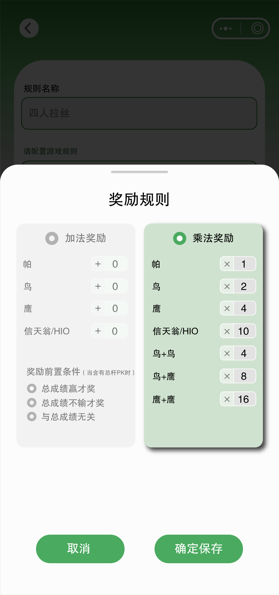
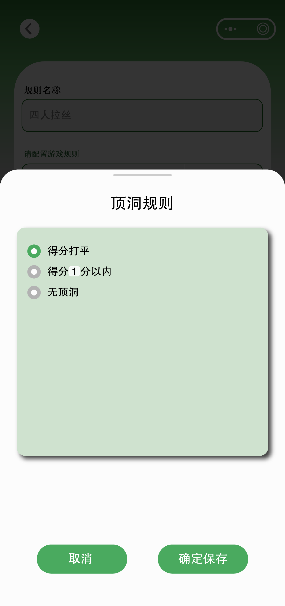
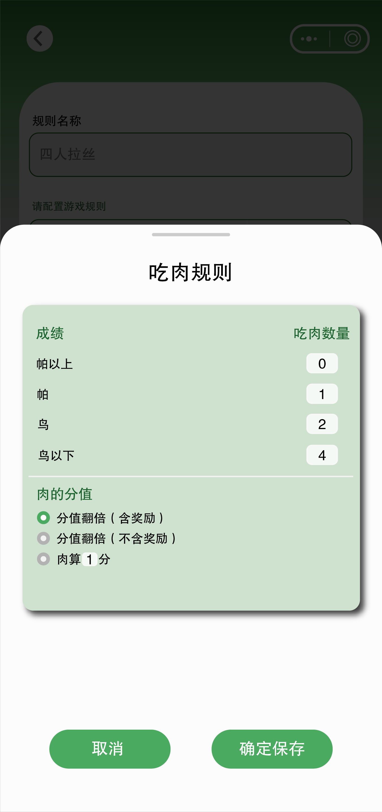
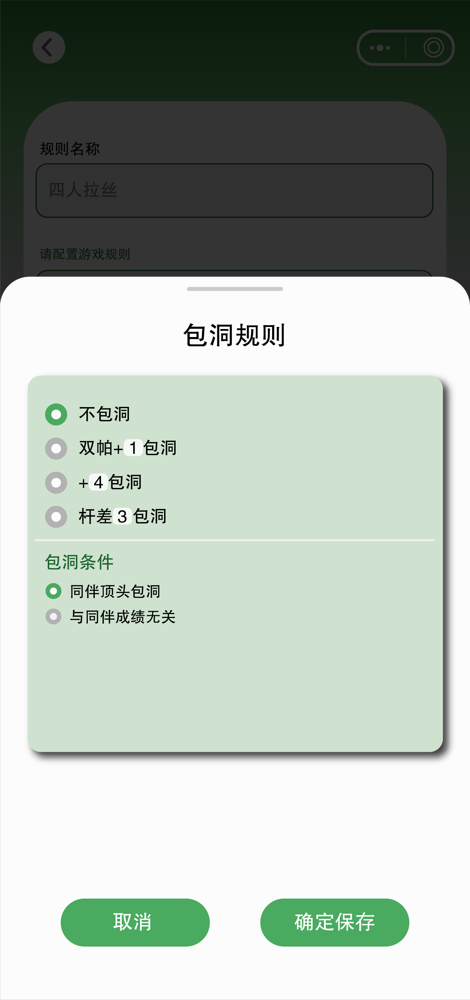

# 四人拉丝

## 概念解释

### 拉丝
"拉丝"是指从多个玩家中"拉"出特定的指标来进行比较。比如 A,B 与 C,D 比赛时：

- **比较"双方的最好成绩"**：A,B组取最好成绩 vs C,D组取最好成绩
- **比较"最差杆数"**：A,B组取最差成绩 vs C,D组取最差成绩  
- **比较"2人杆数相加"**：A+B的总和 vs C+D的总和
- **比较"2人杆数乘积"**：A×B的乘积 vs C×D的乘积

### 顶洞
"顶洞"是指双方成绩一样，打平了的情况。

- **有顶洞**：处理打平的情况，打平时会产生"肉"
- **无顶洞**：打平的洞就跳过，不产生"肉"

### 吃肉
"吃肉"是指处理打平时产生的奖励或惩罚机制。只有在有顶洞（打平）的情况下才需要吃肉规则。

### 包洞
"包洞"是指"负责"、"承担责任"的机制。当团队输了，但其中某个队员表现很好时，由表现差的队员"承包"或"承担全部责任"。

**举例说明**：A,B 与 C,D 比赛，A,B 输了，但A打得很好，B打得很差。如果两人都输同样的钱，对A不公平。包洞机制下，由B"负全责"，B"承包"全部损失，体现"谁的责任谁承担"的公平原则。

## 功能需求

拉丝点数由配置框配置，规则名称应根据用户选择复选框的情况，实时跳出默认规则名称。

当每一项分数都一致的情况下（比如均为1分），名称为"拉丝*点"。

当分数不一致时，如果只有两个指标，则默认名称为"头2尾1""头3总2"等，依此类推。

当分数不一致，且有三个指标，则默认名称为"221""421"等，以此类推。

总杆指标前按钮，是在两个计算方式之间切换。两种总杆指标分别为"总杆和"与"总杆乘积"。

## 拉丝奖励规则
加法奖励中，当拉丝指标没有总杆指标时，奖励前置条件应显示为灰色不可选。

## 拉丝顶洞规则
如果用户选择"无顶洞"，则下一项"吃肉规则"变为灰色不可选。

**逻辑说明**：无顶洞意味着打平的洞跳过，不产生"肉"，所以不需要吃肉规则。

## 拉丝吃肉规则
只有在有顶洞（打平）的情况下，吃肉规则才可选。因为只有打平时才会产生"肉"需要处理。

## 拉丝包洞规则
当用户选择"不包洞"时，下半部分变灰不可选。

**逻辑说明**：不包洞意味着不启用责任分配机制，所以下半部分的责任分配规则配置不可选。

## 交互逻辑总结

1. **智能命名**：根据用户选择的指标实时生成规则名称
2. **条件联动**：
   - 无顶洞 → 吃肉规则灰色不可选
   - 不包洞 → 包洞规则下半部分灰色不可选
   - 无总杆指标 → 奖励前置条件灰色不可选
3. **实时反馈**：用户操作立即反映在界面上